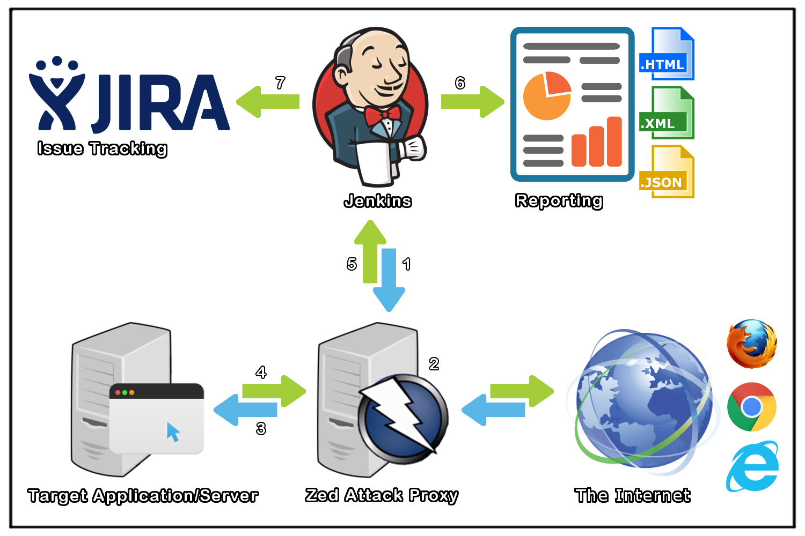

 

Official OWASP Zed Attack Proxy Jenkins Plugin
==============================================

 

The [ZAP Jenkins plugin](https://wiki.jenkins-ci.org/display/JENKINS/ZAProxy+Plugin) is a Jenkins plugin which extends the functionality of the ZAP security tool into a CI Environment.

  - Manage Sessions (Load or Persist)
  - Define Context (Name, Include URLs and Exclude URLs)
  - Attack Contexts (Spider Scan, AJAX Spider, Active Scan) 

You can also:
  - Setup Authentication (Form Based or Script Based)
  - Run as Pre-Build as part of a [Selenium](http://docs.seleniumhq.org/) Build
  - Generate Reports

Table of Contents 
-----------------

- [ZAP as a part of a CI Environment](#zap-as-a-part-of-a-ci-environment)
- [Tech](#tech)
- [Issue Tracking](#issue-tracking)
- [Requirements](#requirements)
	- Custom Tools
	- System Installed
- [Settings](#settings)
	- ZAP Settings
	- Jenkins ZAP Settings
- [ZAP Extensions](#zap-extensions)
	- Export Report
	- JIRA Creator
- [Jenkins Plugins](#jenkins-plugins)
	- Env Inject
	- Summary Display
	- HTML Publisher
- [Development](#development)
- [Building the Plugin](#building-the-plugin)
	- [Development Build](#development-build)
	- [To Install](#to-install)
	- [Production Release](#production-release)
- [Development Rules and Guidelines](#development-rules-and-guidelines)
- [Contributors](#contributors)
- [Version History Issues](#version-history)
- [License](#license)

<a href='#official-owasp-zed-attack-proxy-jenkins-plugin' >
Top
</a>

ZAP as a part of a CI Environment
---------------------------------

1. A Jenkins CI Build step initializes ZAP
2. Traffic flows (Regression Pack) through ZAP (Web Proxy)
3. ZAP modifies requests to include Vulnerability Tests
4. Target Application/Server sends Response back through ZAP
5. ZAP sends reporting data back to Jenkins
6. Jenkins publishes and archives the report(s)
7. Jenkins creates JIRA tickets for the alerts

<a href='#official-owasp-zed-attack-proxy-jenkins-plugin' >
Top
</a>

### Tech

ZAP Jenkins plugin uses a number of open source plugins to work properly:

* [ZAP API] - A REST API which allows you to interact with ZAP programmatically.

And of course the Official ZAP Jenkins plugin is open source with a [public repository][zap jenkins plugin] on GitHub.

<a href='#official-owasp-zed-attack-proxy-jenkins-plugin' >
Top
</a>

### Issue Tracking

* Issues can be created on the <b>Jenkins JIRA</b> for the component [zaproxy-plugin] [Jenkins JIRA].
* <b>Before</b> creating an Issue please read the [JIRA guidelines](https://wiki.jenkins-ci.org/display/JENKINS/How+to+report+an+issue).
* <b>Notice</b>: GitHub Issues have been disabled.

<a href='#official-owasp-zed-attack-proxy-jenkins-plugin' >
Top
</a>

### Installation

ZAP Jenkins plugin requires [Jenkins](https://jenkins.io/) 1.580.1+ to run.

Download and extract the [desired war release](https://updates.jenkins-ci.org/download/war/).

<a href='#official-owasp-zed-attack-proxy-jenkins-plugin' >
Top
</a>

### Requirements

ZAP Jenkins plugin requires [Zed Attack Proxy](https://github.com/zaproxy/zaproxy/wiki/Downloads) 2.5.0+ to run and can be installed via either of the following methods:

* [Custom Tools] - A generic tool installer. You define how tools get installed, and the plugin will automatically install them when needed.
* System Installed - Requires `ZAPROXY_HOME` to be defined as a System Environment Variable.

Documentation, how to setup ZAP for use with Jenkins can be found here:

* [documentation/customtools/README.md] [customtools]
* [documentation/systeminstalled/README.md] [systeminstalled]

<a href='#official-owasp-zed-attack-proxy-jenkins-plugin' >
Top
</a>

### Settings

* ZAP Settings - A guide to configure ZAP in order to minimize the time that it takes for ZAP Jenkins to perform certain functions.
* Jenkins ZAP Settings - A guide to configure some ZAP Settings in Jenkins.

Documentation, how to setup ZAP and Jenkins ZAP can be found here:

* [documentation/zapsettings/README.md] [zapsettings]
* [documentation/jenkinszapsettings/README.md] [jenkinszapsettings]

<a href='#official-owasp-zed-attack-proxy-jenkins-plugin' >
Top
</a>

### ZAP Extensions

The Official OWASP ZAP Jenkins plugin is currently extended with the following ZAP plugins

* [Export Report] - An official ZAP marketplace extension which allows you to customize content and export in a desired format (.<b>xhtml</b> , .<b>xml</b> , .<b>json</b> ). Supports GUI, command line and API calls.
* JIRA Creator - An unofficial ZAP extension which allows you to create JIRA issues. It is an add-on <b>NOT</b> bundled with ZAP, nor available in the marketplace. <b>[DOWNLOAD](https://github.com/0xkasun/security-tools/raw/master/build/zap-exts/jiraIssueCreater-alpha-1.zap) AT YOUR OWN RISK AND DISCRETION</b>.

Documentation, how to use them in your own job configuration can be found here:

* [documentation/exportreport/README.md] [exportreport]
* [documentation/jiracreator/README.md] [jiracreator]

<a href='#official-owasp-zed-attack-proxy-jenkins-plugin' >
Top
</a>

###  Jenkins Plugins

* [Env Inject] - Makes it possible to have an isolated environment for your jobs by setting up job defined environment variables (Not available when run in Pre-Build).
* [Summary Display] - This plugin allows an easy and fully customized build report display. Useful for it's Post-Build action to Archive the artifacts, copying over a generated report into the build's directory. Can also be from the build.
* [HTML Publisher] - This plugin publishes HTML reports. Useful for displaying the latest html or xhtml report.

Documentation, how to use them in your own job configuration can be found here:

* [documentation/envinject/README.md] [envinject]
* [documentation/summarydisplay/README.md] [summarydisplay]
* [documentation/htmlpublisher/README.md] [htmlpublisher]

<a href='#official-owasp-zed-attack-proxy-jenkins-plugin' >
Top
</a>

### Development

The Official OWASP ZAP Jenkins plugin is a Maven Jelly Project.

Start the local Jenkins instance:

    $ mvn hpi:run

<a href='#official-owasp-zed-attack-proxy-jenkins-plugin' >
Top
</a>

### Building the Plugin

##### Development Build

    $ mvn clean package -e

to create the plugin `.hpi` file.

##### To Install:

1. copy the resulting `../target/zaproxy.hpi` file to the `$JENKINS_HOME/plugins` directory. <i>Restart Jenkins</i>.

2. or use the plugin management console `localhost:8080/pluginManager/advanced` to upload the `.hpi` file. <i>Restart Jenkins</i>.

##### Production Release

    $ mvn release:prepare release:perform -B

<a href='#official-owasp-zed-attack-proxy-jenkins-plugin' >
Top
</a>

### Development Rules and Guidelines

See [Code Style Guidelines](CONTRIBUTING.md)

<a href='#official-owasp-zed-attack-proxy-jenkins-plugin' >
Top
</a>

### Contributors

See [Contributors](CONTRIBUTORS.md)

<a href='#official-owasp-zed-attack-proxy-jenkins-plugin' >
Top
</a>

### Version History

See [History](HISTORY.md)

<a href='#official-owasp-zed-attack-proxy-jenkins-plugin' >
Top
</a>

### License

	The MIT License (MIT)
	
	Copyright (c) 2016 Official ZAP Jenkins Plugin and its related class files.
	
	Permission is hereby granted, free of charge, to any person obtaining a copy
	of this software and associated documentation files (the "Software"), to deal
	in the Software without restriction, including without limitation the rights
	to use, copy, modify, merge, publish, distribute, sublicense, and/or sell
	copies of the Software, and to permit persons to whom the Software is
	furnished to do so, subject to the following conditions:
	
	The above copyright notice and this permission notice shall be included in all
	copies or substantial portions of the Software.
	
	THE SOFTWARE IS PROVIDED "AS IS", WITHOUT WARRANTY OF ANY KIND, EXPRESS OR
	IMPLIED, INCLUDING BUT NOT LIMITED TO THE WARRANTIES OF MERCHANTABILITY,
	FITNESS FOR A PARTICULAR PURPOSE AND NONINFRINGEMENT. IN NO EVENT SHALL THE
	AUTHORS OR COPYRIGHT HOLDERS BE LIABLE FOR ANY CLAIM, DAMAGES OR OTHER
	LIABILITY, WHETHER IN AN ACTION OF CONTRACT, TORT OR OTHERWISE, ARISING FROM,
	OUT OF OR IN CONNECTION WITH THE SOFTWARE OR THE USE OR OTHER DEALINGS IN THE
	SOFTWARE.

See [License](LICENSE)

   [zap jenkins plugin]: <https://github.com/jenkinsci/zaproxy-plugin>
   [Jenkins JIRA]: <https://issues.jenkins-ci.org/browse/JENKINS-39416?jql=project%20%3D%20JENKINS%20AND%20status%20in%20(Open%2C%20%22In%20Progress%22%2C%20Reopened)%20AND%20component%20%3D%20zaproxy-plugin>

   [ZAP API]: <https://github.com/zaproxy/zaproxy/wiki/ApiDetails>
   [Custom Tools]: https://wiki.jenkins-ci.org/display/JENKINS/Custom+Tools+Plugin
   [Export Report]: <https://github.com/zaproxy/zap-extensions/wiki/HelpAddonsExportreportExportreport>
   [Env Inject]: <https://wiki.jenkins-ci.org/display/JENKINS/EnvInject+Plugin>
   [Summary Display]: <https://wiki.jenkins-ci.org/display/JENKINS/Summary+Display+Plugin>
   [HTML Publisher]: <https://wiki.jenkins-ci.org/display/JENKINS/HTML+Publisher+Plugin>
   
   [zapsettings]: <documentation/zapsettings/README.md>
   [jenkinszapsettings]: <documentation/jenkinszapsettings/README.md>
   [customtools]: <documentation/customtools/README.md>
   [systeminstalled]: <documentation/systeminstalled/README.md>
   [exportreport]: <documentation/exportreport/README.md>
   [jiracreator]: <documentation/jiracreator/README.md>
   [envinject]: <documentation/envinject/README.md>
   [summarydisplay]: <documentation/summarydisplay/README.md>
   [htmlpublisher]: <documentation/htmlpublisher/README.md>