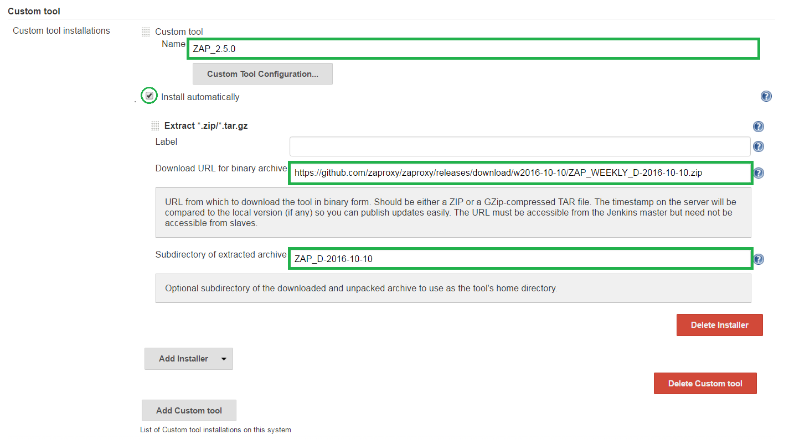
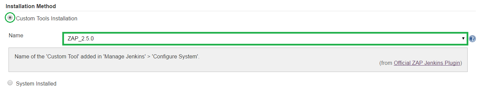

<a href='https://github.com/JordanGS/zaproxy-plugin/tree/development#table-of-contents-'>
Home
</a>

Custom Tools: Jenkins Config
============

### Jenkins  Manage Jenkins  Configure System  Custom Tool

`http://localhost:8080/configure`

#### 1. Name

* A required field which will identify the tool installed.

#### 2. Download URL for binary archive

- URL from which to download the tool in binary form. Should be either a .<b>zip</b> or a GZip-compressed .<b>tar</b> file.
- ZAP releases can be found [here](https://github.com/zaproxy/zaproxy/releases/).
	- <b>Notice</b>: Weekly releases are removed after a while (there's no fixed schedule for it).
- The .<b>zip</b> of the version which was used to test version 2.0.0 release can be found [here]()

#### 3. Subdirectory of extracted archive

* Optional subdirectory of the downloaded and unpacked archive to use as the tool's home directory. Only required if the archive has a subfolder.

Custom Tools: Extracted Location
============

`%JENKINS_HOME/tools/com.cloudbees.jenkins.plugins.customtools.CustomTool/${Name}/${Subdirectory of extracted archive}`

Custom Tools: Job Configuration
============

`http://localhost:8080/job/JOB_NAME/`

##### 1. Select Custom Tools Installation

##### 2. Specify Name 

* Same as the one provided above, you can have multiple installations so be sure to pick the one you want.

<a href='https://github.com/JordanGS/zaproxy-plugin/tree/development#table-of-contents-'>
Home
</a>
