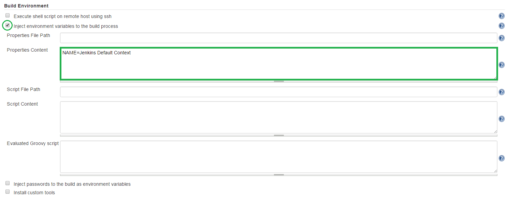

<a href='https://github.com/JordanGS/zaproxy-plugin/tree/development#table-of-contents-'>
Home
</a>

Environment Inject
==================

### Jenkins  `JOB_NAME`  Configure  Build Environment

`http://localhost:8080/job/JOB_NAME/`

#### 1. Check <i>Inject environment variables to the build process</i> to enable job specific environment variables.

- <b>Notice</b>: These <b>CANNOT</b> be used when the ZAP Jenkins plugin is run as a pre-build step.

#### 2. Specify Properties Content

- Format: `VARIABLE_NAME=VARIABLE_VALUE`
- New entries are represented by line breaks.

#### 3. Usage

Certain fields in the Jenkins ZAP plugin accept <b>System Environment Variables</b>, <b>Build Variables</b> as well as <b>Environment Inject Plugin Variables</b>. See the  for each field to see more details.

All variable can be called with `${VARIABLE_NAME}` 

<a href='https://github.com/JordanGS/zaproxy-plugin/tree/development#table-of-contents-'>
Home
</a>