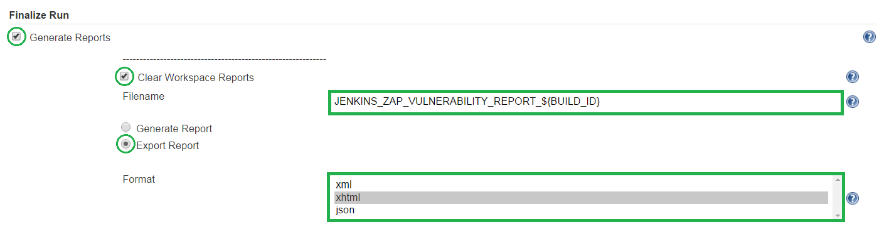
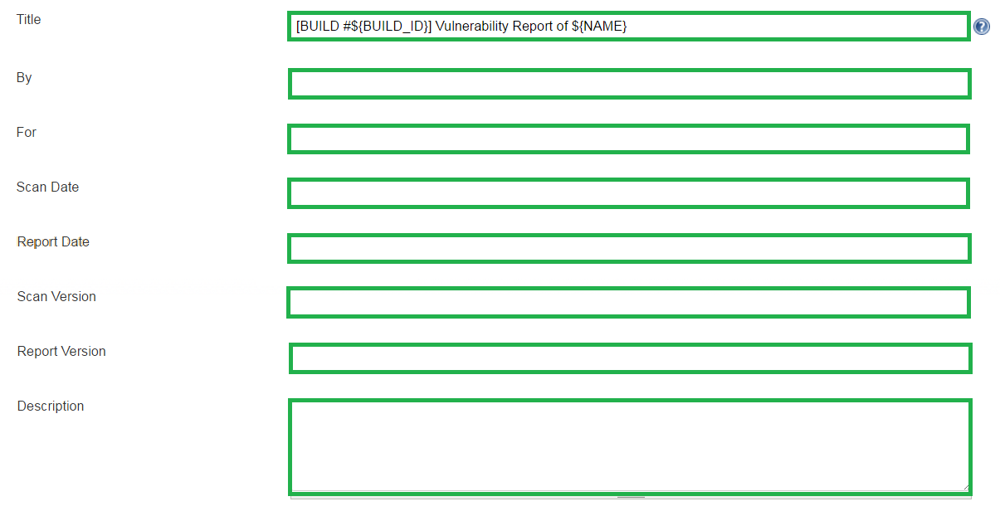
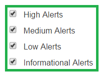
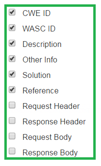

<a href='https://github.com/JordanGS/zaproxy-plugin/tree/development#table-of-contents-'>
Home
</a>

Export Report
=============

#### 1. Generate Reports

- Clear Workspace Reports
	- Delete all previously generated reports from the workspace before any new reports are generated. (.<b>html</b> , .<b>xhtml</b> , .<b>xml</b> , .<b>json</b> )
	- Useful when used in conjunction with [Summary Display](../summarydisplay/README.md) and [HTML Publisher](../htmlpublisher/README.md)
- Filename
	- Specify a filename for the ZAP Report.
	- The file extension is not necessary.
	- The report will be saved into the <i>Jenkins Job's Workspace</i>
	- Example of a good filename: `JENKINS_ZAP_VULNERABILITY_REPORT_${BUILD_ID}`.

#### 2. Export Report
- Format: You can select multiple formats.
	- .<b>xhtml</b> 
	- .<b>xml</b> 
	- .<b>json</b> 

Export Report: Source Details
=============

- Title
	- Provide a title for the report to be generated.
	- Example of a good title: `[BUILD #${BUILD_ID}] Vulnerability Report of ${NAME}`.

Export Report: Alert Severity
=============

Include/Exclude Alerts by Severity.

Export Report: Alert Details
=============

Include/Exclude Details of each Alert.

<a href='https://github.com/JordanGS/zaproxy-plugin/tree/development#table-of-contents-'>
Home
</a>
