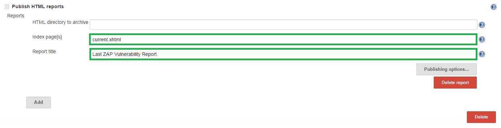
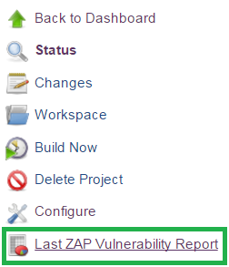

<a href='https://github.com/JordanGS/zaproxy-plugin/tree/development#table-of-contents-'>
Home
</a>

HTML Publisher: Job Config
==========================

### Jenkins  `JOB_NAME`  Configure  Post-build Actions  Publish HTML Reports

`http://localhost:8080/job/JOB_NAME/`

<b>Notice</b>: This plugin is best used in conjunction with [Export Report](../exportreport/README.md).

<b>Recommended</b>: To be used in conjunction with [Summary Display](../summarydisplay/README.md).

#### 1. Index page[s]

`current.xhtml`

#### 2. Report title

`Last ZAP Vulnerability Report`

HTML Publisher: Last Report
===========================

### Jenkins  `JOB_NAME`

This will always point to the last generated report.

<a href='https://github.com/JordanGS/zaproxy-plugin/tree/development#table-of-contents-'>
Home
</a>
