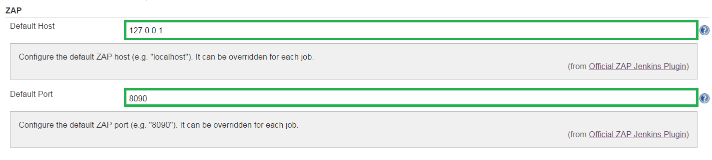

<a href='https://github.com/JordanGS/zaproxy-plugin/tree/development#table-of-contents-'>
Home
</a>

Jenkins ZAP Settings
====================

### Jenkins  Manage Jenkins  Configure System  ZAP

Configure the default ZAP host (e.g. "localhost") and default ZAP port (e.g. "8090"). They can be overridden for each job.

<a href='https://github.com/JordanGS/zaproxy-plugin/tree/development#table-of-contents-'>
Home
</a>
