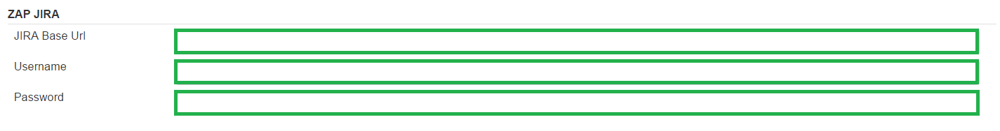
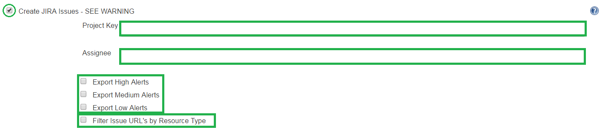

<a href='https://github.com/JordanGS/zaproxy-plugin/tree/development#table-of-contents-'>
Home
</a>

<b>WARNING</b>: JIRA functionality requires an add-on <b>NOT</b> bundled with ZAP, nor available in the marketplace.

<b>USE AT YOUR OWN RISK AND DISCRETION</b>.

JIRA Creator: Jenkins Config
============

### Jenkins  Manage Jenkins  Configure System

`http://localhost:8080/configure`

Required ONLY if you are planning create JIRA issues.

JIRA Creator: Job Configuration
============

<b>Required:</b> Set the JIRA Base URL, JIRA Username and JIRA Password as shown above.

##### 1. Project Key

##### 2. Assignee 

##### 3. Export Alerts

- Issues can be created depending on the alert level of each issue.
- A user can choose to export alerts as JIRA's depending on their severity.
	- High
	- Medium
	- Low
	- Informational
- <b>Notice</b>: At least one alert level has to be checked or else the plugin will fail.

##### 4. Filter Issue URL's by Resource Type 

- Filter issue URLS by resource type is an optional feature which can be used to categorize the urls by resource type.
	- e.g. css, html, js, jsp etc.

<a href='https://github.com/JordanGS/zaproxy-plugin/tree/development#table-of-contents-'>
Home
</a>
