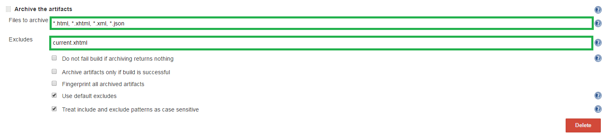
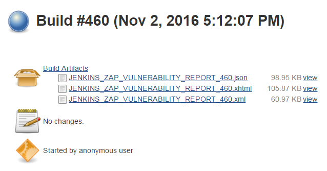

<a href='https://github.com/JordanGS/zaproxy-plugin/tree/development#table-of-contents-'>
Home
</a>

Summary Display: Job Config
===================================

### Jenkins  `JOB_NAME`  Configure  Post-build Actions  Archive the artifacts

`http://localhost:8080/job/JOB_NAME/`

<b>Notice</b>: This plugin is best used in conjunction with [Export Report](../exportreport/README.md).

<b>Recommended</b>: To be used in conjunction with [HTML Publisher](../htmnlpublisher/README.md).

<b>Recommended</b>: To make sure that older reports are <b>NOT</b> archived, please select <i>[Clear Workspace Reports](../exportreport/README.md)</i>.

#### 1. Files to archive

`*.html, *.xhtml, *.xml, *.json`

#### 2. Excludes

`current.xhtml`

<b>Notice</b>: Only enter a value for excludes if also using HTML Publisher.

Summary Display: Build Archive
==============================

### Jenkins  `JOB_NAME`  `BUILD_ID`

`http://localhost:8080/job/JOB_NAME/BUILD_ID`

<b>Notice</b>: All the file that match the extensions above will be accessible in the build folder.

<b>Notice</b>: Need to generate a report in order for it to be archived.

<a href='https://github.com/JordanGS/zaproxy-plugin/tree/development#table-of-contents-'>
Home
</a>