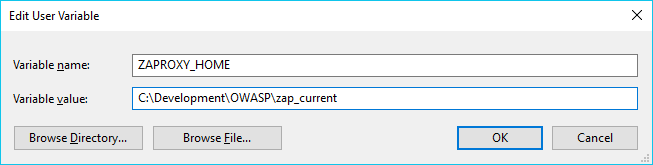
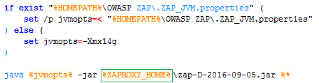
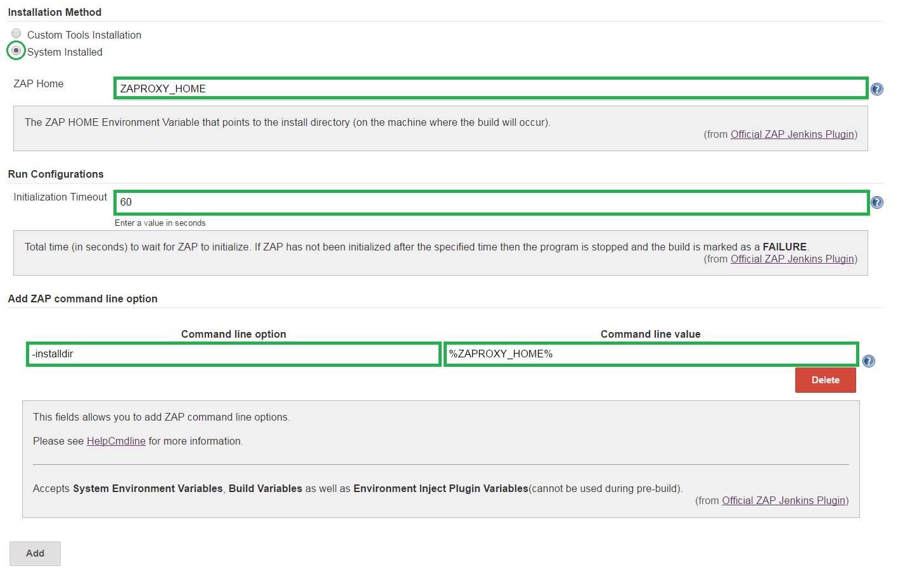

<a href='https://github.com/JordanGS/zaproxy-plugin/tree/development#table-of-contents-'>
Home
</a>

System Installed: Extract ZAP
================

#### 1. Download ZAP

- ZAP releases can be found [here](https://github.com/zaproxy/zaproxy/releases/).
	- <b>Notice</b>: Weekly releases are removed after a while (there's no fixed schedule for it).
- The .<b>zip</b> of the version which was used to test version 2.0.0 release can be found [here]()

#### 2. Determine path

- Determine where to keep ZAP, in my case ZAP is located in `C:\Development\OWASP\zap_current\`
	- <b>Notice</b>: Do <b>NOT</b> use spaces for folder names.

System Installed: Environment Variable
================

#### 1. Setup your `ZAPROXY_HOME` Environment Variable

* Remember to add `%ZAPROXY_HOME%` to your `Path`.

System Installed: .bat Modification
================

#### 1. Add `%ZAPROXY_HOME%`

#### 2. Increase allocated RAM

* See [Database Size Vs. Available Memory](../zapsettings/README.md#3-database-size-vs-available-memory).

#### 3. Ensure correct .<b>jar</b> is used.

System Installed: Shortcut (Optional)
================

#### 1. Deskstop shortcut

- Create a shortcut to `%ZAPROXY_HOME%\zap.bat -installdir %ZAPROXY_HOME%`.
	- <b>Notice</b>: If this works then it should also work from Jenkins.

System Installed: Job Configuration
============

##### 1. Select System Installed

##### 2. Specify ZAP Home

##### 3. Specify Initialization Timeout

##### 4. Add ZAP command line options

- Please see [HelpCmdline](https://github.com/zaproxy/zap-core-help/wiki/HelpCmdline) for more information.
	- <b>Notice</b>: Adding ZAP command line options can interfere with other UI option of the plugin. <b>Use with caution</b>!
	- <b>Notice</b>: The only <b>required</b> command line option is `installdir` as indicated above.

<a href='https://github.com/JordanGS/zaproxy-plugin/tree/development#table-of-contents-'>
Home
</a>
