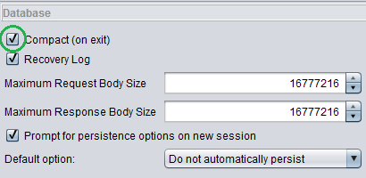

<a href='https://github.com/JordanGS/zaproxy-plugin/tree/development#table-of-contents-'>
Home
</a>

ZAP Settings
============

### ZAP  Tools  Options...  Database

#### 1. Compact

- Unchecked by default, however because we want ZAP Jenkins to load sessions in as short a time as possible, therefore make sure this is <b>checked</b>
	- <b>Notice</b>: Close operation may take a little longer.

#### 2. Recovery Log

- Checked by default, keep as is.

#### 3. Database Size Vs. Available Memory

- Increase the Java Heap Memory that the application is allowed to use. The amount you should allocate is: `<MAX_AVAILABLE_RAM> - 2 GB`. This can be done by `jvmopts` in [zap.bat](../systeminstalled/README.md#system-installed-bat-modification)
	- <b>Notice</b>: This is important and directly correlated to your database size. Due to a bug/feature/constraint with ZAP, it is only able to cleanly close your session's that are a maximum of 2 GB less than your `<ALLOCATED_RAM>`. I have allocated 14GB of RAM to ZAP for use, ZAP can only cleanly close a session of 12GB. This means that you should have a one context to one session relationship.

<a href='https://github.com/JordanGS/zaproxy-plugin/tree/development#table-of-contents-'>
Home
</a>
